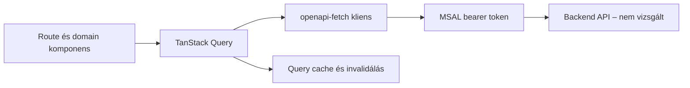
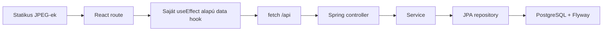

# Lens és Nisztor–Bukovina Platform: architektúra és fejlődési út

## 1. Hatókör és bizonyíték

Ez a dokumentum a 2026-08-06-i helyi forráskód statikus vizsgálatára épül:

- **Lens:** `Look_Frontend/frontend` – vállalati React frontend és annak Azure-infrastruktúrája. A Lens backendje nem volt a vizsgálat része.
- **Panzió:** `ppanzio/nisztor-bukovina-platform` – React frontend, Spring Boot backend, PostgreSQL-séma és dokumentáció.

A Lens munkakönyvtára nem volt tiszta, ezért a vizsgálat a helyi, még nem feltétlenül commitolt állapotot is látja. A panziós repository tiszta volt. A megállapítások nem helyettesítenek terheléses tesztet, penetration testet vagy production mérést. A „gyorsabb” és „jobban skálázódik” állítások ezért csak akkor szerepelnek tényként, ha azt konkrét implementáció támasztja alá; más esetben kockázatról vagy ajánlásról van szó.

## 2. A Lens felépítése

```text
src/
├── api/                 # OpenAPI-ból generált típusok, kliens, query definíciók
├── auth/                # MSAL hitelesítés, szerepkörök és jogosultságok
├── routes/              # TanStack Router route-ok, route-szintű adatfolyam
├── components/
│   ├── domain/          # üzleti területenkénti komponensek
│   ├── ui/              # közös UI-primitívek
│   ├── form/            # form-integrációk
│   └── grid/            # újrahasznosítható grid elemek
├── contexts/            # valóban több területet érintő kliensállapot
├── hooks/               # közös interakciós logika
├── lib/                 # általános segédek, telemetry, hibakezelés
├── mocks/               # OpenAPI-típusos MSW mockok
└── assets/
```

A böngészőtől az API-ig tartó fő út:



Igazolt erősségek:

- A TanStack Router automatikus route code splittinget generál (`vite.config.ts`).
- A TanStack Query egységes cache-, loading-, mutation- és hibakezelési réteget ad (`src/main.tsx`).
- Az API-típusok OpenAPI-ból generálódnak, az `openapi-fetch` kliens minden kéréshez tokent és egységes hibakezelést ad (`src/api/api.ts`).
- A jogosultságok route- és műveletszinten is megjelennek. Ez jó UX, de önmagában nem backend-biztonsági határ.
- Az AG Grid, virtualizáció és lapozott/infinite query minták nagy adathalmazokra is használható eszköztárat biztosítanak.
- Unit, Playwright E2E és axe accessibility tesztek, determinisztikus MSW mockok, külön E2E környezet és CI pipeline létezik.
- Application Insights, route page view, trace-rotáció, közös error boundary és felhasználói hibavisszajelzés van.
- Bicep kezeli a Static Web App, Front Door, WAF, Key Vault, source map storage és TLS infrastruktúrát.

Korlátok, amelyeket nem szabad lemásolni:

- A Lens belső, adatintenzív alkalmazás; AG Grid, enterprise chart és a 40+ UI-primitív túlzás lenne egy kis publikus panzióoldalra.
- A mobil támogatás a Lens dokumentációja szerint csak „best effort”; a panzióoldalnak ezzel szemben mobile-firstnek kell lennie.
- A Lens képkezelése nem referencia: a repositoryban alig van tartalmi kép.
- A lapozás nem mindenhol ideális: van `take: 20000`, a `fetchAllPaginatedDataInBatches` pedig minden hátralévő oldalt egyszerre kér le. Ez nagy adatmennyiségnél terhelési csúcsot okozhat.
- Infrastruktúra-dokumentációs eltérés van: a README 100 kérés/perc WAF limitet ír, míg a Bicep jelenleg 1000 kérést/5 perc értéket tartalmaz. A futó konfigurációt külön kell ellenőrizni; a dokumentáció nem elég bizonyíték.
- A WAF dokumentált módja `Detection`, ezért a managed szabályok nem feltétlenül blokkolnak. Ezt nem szabad kész megelőző védelemként kezelni.

## 3. A panziós projekt jelenlegi felépítése

```text
frontend/src/
├── app/                 # router és provider composition
├── features/            # üzleti feature-ek, jelenleg accommodation
├── shared/api/          # kézzel írt fetch kliens és DTO típusok
├── i18n/                # hu/ro/en routing és fordítások
└── test/

backend/src/main/java/com/bukovina/platform/
├── accommodation/       # guesthouse, roomtype, pricing, amenity, booking
├── tourism/             # activity, startour, itinerary
├── support/             # auth, admin, notification, translation
└── shared/              # konfiguráció, exception, validation
```



Ez az alap több ponton kifejezetten jó:

- A backend moduláris monolit és package-by-feature szerkezetű. Az ArchUnit automatikusan ellenőrzi a modulhatárokat, a tiltott controller–DAO függést és a ciklusokat.
- A controller → service → repository irány tiszta, a query service read-only tranzakciót használ.
- A PostgreSQL-séma Flyway-verziózott, adatbázis constraintjei vannak, az integration tesztek valódi PostgreSQL 16 Testcontainert használnak.
- A panzió, fordítás és kép külön relációs modell. A `slug` egyedi, a cover képet részleges egyedi index védi, az inaktiválás nem törli az adatot.
- A frontend és backend relatív `/api` szerződése same-origin deploymentet tesz lehetővé.
- A háromnyelvű URL, a támogatott nyelvkód ellenőrzése és a magyar fallback a Lensnél fejlettebb, a termékhez illő megoldás.
- A frontend használ `AbortController`-t, stabil kulcsokat, alt szöveget, lazy gallery képeket és billentyűzetes lightbox navigációt.
- A követelmények, ADR-ek és traceability dokumentációja már most erős; ezt meg kell őrizni.
- A GitHub Actions PR-on és `main` pushnál ellenőrzi a backend és frontend buildet, formázást, lintet és teszteket.

## 4. Közvetlen összehasonlítás

| Terület | Lens | Panzió most | Értékelés |
| --- | --- | --- | --- |
| Modulhatárok | Frontend domain mappák és coding standardok | Backend ArchUnit + feature modulok | A panziós backend alapja legalább olyan tudatos; ne bontsd microservice-ekre. |
| API-szerződés | Generált TypeScript séma és típusos kliens | OpenAPI fájl van, de a frontend típusai kézzel írtak és `as T` castot használnak | A Lens megoldása biztonságosabb drift ellen. |
| Szerverállapot | Query cache, deduplikáció, invalidálás, mutation állapot | Saját `useEffect` + `useState`, cache nélkül | Két GET-nél elfogadható, több feature-nél hamar drága lesz fenntartani. |
| Routing | Típusos, generált, code-split route-ok | Egyszerű React Router route objektumok | A panziós megoldás most elég; később route lazy loading szükséges. |
| Nagy listák | Infinite query, virtualizáció, AG Grid | A lista teljes `List` választ ad | Két panzióhoz nem kell pagination; túrákhoz és admin listákhoz kell majd. |
| Képek | Nincs összehasonlítható tartalmi galéria | 60 JPEG, kb. 17,5 MiB; legnagyobb kb. 4,8 MiB | Itt nem a Lens a minta; külön image pipeline kell. |
| Hitelesítés | MSAL, bearer token, kliensoldali permission UX | Minden endpoint `permitAll`, CSRF kikapcsolva | Publikus GET-hez rendben, bármilyen admin/POST előtt blokkoló hiányosság. |
| Tesztelés | Sok unit és E2E scenario, axe, MSW | Erős backend integration/architecture teszt, 1 frontend tesztfájl, nincs E2E | A két projekt erősségeit össze kell adni. |
| Hibakezelés | Közös HTTP error, toast, error boundary, telemetry | Boolean `error`, nincs közös API error contract vagy error boundary | A panziós projektnek egységesítenie kell. |
| Observability | Application Insights és trace-ek | Csak Actuator health igazolható | Metrics, strukturált log és tracing hiányzik. |
| Production infra | IaC, CDN/Front Door, TLS, WAF, Key Vault, deployment pipeline | Csak lokális PostgreSQL Compose; production nincs definiálva | Ez a legnagyobb üzemeltetési rés. |
| i18n és publikus web | Nem többnyelvű, belső app | Háromnyelvű, route-alapú, branded oldal | A panziós projekt jobb kiindulópont, de SEO/prerender még hiányzik. |

## 5. Fejlesztési javaslatok prioritási sorrendben

### P0 – a következő publikus vagy admin feature előtt

#### 5.1 Képoptimalizálási pipeline

A böngésző jelenleg ugyanazt a teljes JPEG-et használja kártyához, hero képhez, thumbnailhez és lightboxhoz. Nincs `srcset`, `sizes`, explicit `width`/`height`, modern formátum vagy fájlnév-alapú cache invalidálás. Több fájl EXIF adatot is tartalmaz.

Ajánlott cél:

1. Build vagy feltöltés közben készíts több szélességet és WebP/AVIF variánst, JPEG fallbackkel.
2. Külön thumbnail, card, hero és full-size forrás legyen; a 4,8 MiB-os cover ne töltődjön le kártyaméretben.
3. Távolítsd el az EXIF/metaadatokat, rögzíts `width`/`height` értéket, használj `srcset` és `sizes` attribútumot.
4. Használj content-hash vagy verziózott fájlnevet és hosszú immutable cache-t.
5. Amíg nincs admin feltöltés, a statikus asset egyszerű és jó. Feltöltés bevezetésekor objektumtár + CDN legyen, az adatbázisban csak kulcs, dimenzió, MIME, alt szöveg, sorrend és státusz maradjon.
6. Feltöltéskor szerveroldali méret-, pixelszám-, magic-byte- és MIME-ellenőrzés, újrakódolás, metaadat-törlés, véletlen objektumkulcs és szükség esetén malware scan kell. A kliens által küldött fájlnév vagy MIME nem megbízható.

Ellenőrzés: Lighthouse és böngésző Network panel mobil throttling mellett; dokumentáld a teljes oldal képbyte-jait, LCP képet, CLS-t és a letöltött variáns tényleges pixelszámát.

#### 5.2 Automatikusan ellenőrzött API-szerződés

Az `openapi.yaml` jó contract-first alap, de a jelenlegi `GuesthouseSummary` és `GuesthouseDetail` típusok kézzel vannak duplikálva. A `response.json() as T` nem validál semmit runtime-ban, és a CI-ben nem találtam az OpenAPI–controller egyezést automatikusan bizonyító lépést.

Ajánlás:

- Generálj frontend típust és klienst az OpenAPI-ból, a Lens `openapi-typescript` + `openapi-fetch` mintájához hasonlóan.
- A generált fájl ne legyen kézzel szerkeszthető.
- CI-ben validáld az OpenAPI-t, generáld újra a klienst, és bukjon a build, ha nem commitolt eltérés keletkezik.
- A backend integration teszt validálja a válaszokat a szerződés ellen, vagy hasonlítsa össze a generált API-leírást a normatív fájllal.
- Vezess be egységes hibasémát, például RFC 9457-kompatibilis `ProblemDetail` választ mezőhibákkal és correlation ID-val.

#### 5.3 Biztonsági határ az első író végpont előtt

A jelenlegi `SecurityConfiguration` minden kérést enged és kikapcsolja a CSRF-et. Ez a mostani két publikus GET végpontnál tudatos foundation állapot, de admin-, foglalási vagy kapcsolati POST-tal együtt nem maradhat így.

Szükséges sorrend:

1. Különítsd el a publikus és admin endpointokat; a default szabály legyen tiltó, csak a szükséges publikus GET legyen explicit `permitAll`.
2. Válassz és dokumentálj admin identity mechanizmust külön ADR-ben. A Lens MSAL-ja példa, nem automatikusan megfelelő választás ehhez a termékhez.
3. A backend ellenőrizze a szerepköröket; a frontend elrejtés csak UX.
4. Ha session/cookie alapú auth lesz, a CSRF-védelmet vissza kell kapcsolni. Stateless bearer tokennél külön fenyegetési modell alapján dönts.
5. A normatív IP- és e-mail-alapú rate limitet a foglalási végponttal együtt vezesd be. Több backend instance esetén közös Redis állapot kell; a WAF nem tudja az e-mail-alapú üzleti limitet helyettesíteni.
6. Adj biztonsági headereket a production reverse proxy/CDN réteghez: CSP, HSTS, `X-Content-Type-Options`, `Referrer-Policy`, `Permissions-Policy` és frame policy. Az értékeket a tényleges hostok és integrációk alapján állítsd be.
7. Teszteld automatikusan a 401/403/429 eseteket, a jogosultság-emelést, inputlimiteket és azt, hogy személyes adat vagy token nem kerül logba.

### P1 – amikor több képernyő és módosítás jelenik meg

#### 5.4 Standard szerverállapot-kezelés

A saját hook már abortot, request keyt, loadingot és errort kezel; ez annak a jele, hogy egy query réteg felelősségét kezdi újraimplementálni. TanStack Query bevezetése indokolt, amikor megjelenik admin módosítás, cache invalidálás, több komponens által használt adat vagy háttérfrissítés. Csak két publikus GET miatt önmagában még nem kötelező.

Javasolt elvek:

- server state: TanStack Query vagy route loader;
- URL-ben megosztható filter és oldalállapot: router search params;
- rövid életű UI állapot: lokális `useState`;
- több feature-t érintő stabil dependency: context;
- Redux csak bizonyított, összetett kliensállapot esetén – jelenleg nincs rá szükség.

#### 5.5 Pagination és adatbázis-lekérdezések

Két panzió listáját nem kell lapozni. Pagination ott kell, ahol az adatmennyiség valóban nőhet: túrák, tevékenységek, foglalási kérelmek és admin auditlista.

- Az API-ban legyen szerveroldali filter, rendezés, dokumentált default és maximum oldalméret.
- Admin táblánál a `Page` és total count hasznos lehet; végtelen publikus katalógusnál a `Slice` vagy stabil cursor olcsóbb és konzisztens lehet.
- Nagy és gyakran változó listánál ne használj korlátlan offsetet vagy „tölts le mindent” segédfüggvényt.
- Minden támogatott filter/rendezés kapjon a valós query plan alapján indexet. A jelenlegi egyedi slug index jó; nagyobb listánál az `active + display_order` queryt `EXPLAIN ANALYZE` alapján vizsgáld.
- A jelenlegi JPA modellben a translations és images `@OneToMany` kollekciók bejárása lista közben N+1 query kockázatot jelent. Két rekordnál ez nem probléma, de skálázás előtt mérd Hibernate statisztikával, majd használj célzott DTO projectiont vagy megfelelő `EntityGraph`/fetch tervet. Ne kapcsolj mindent globálisan eagerre.

#### 5.6 Frontend teljesítmény és SEO

- A route-ok most statikusan importáltak; a kis bundle-nél ez jó. Feature-növekedéskor React Router lazy route modulokkal bontsd accommodation, tourism és administration részekre.
- A publikus panzióoldal SEO-igénye nagyobb, mint a belső Lens appé. A jelenlegi SPA minden route-on ugyanazt a statikus title/description értéket adja.
- A két, ritkán változó panzióoldalhoz elsőként prerender/SSG megoldást értékelj, nem feltétlenül teljes SSR-t. Legyen route-onként title, description, canonical, `hreflang`, Open Graph, sitemap, robots és ellenőrzött strukturált adat.
- Állíts fel bundle- és image-budgetet a CI-ben. Code splittinget csak mérés alapján adj hozzá; ne másold át a Lens teljes dependency készletét.
- Publikus tartalomnál először HTTP/CDN cache-t, ETag-et és optimalizált adatbázis-queryt használj. Redis general-purpose cache csak mért szükség és invalidálási terv mellett indokolt; ez összhangban van a meglévő ADR-rel.

#### 5.7 UX és accessibility

A skip link, alt szövegek és nyílbillentyűk jó alapok. A lightboxnál még ellenőrizni kell a fókusz beléptetését, trapet, bezárás utáni fókusz-visszaadást, háttér inert állapotát és scroll lockot. A Lens Radix komponensei ezt részben készen adják, de nem szükséges az egész UI könyvtár átvétele.

Adj hozzá Playwright E2E-t legalább ezekre:

- nyelvváltás és fallback;
- lista → részlet navigáció;
- gallery egérrel és billentyűzettel;
- API 404/500/offline állapot;
- mobil viewport;
- axe accessibility smoke test.

### P2 – production növekedés és üzleti kritikus folyamatok

#### 5.8 Observability és hibakezelés

- Strukturált backend log, request/correlation ID és környezetenkénti logszint.
- Micrometer/Actuator metrics: request latency, error rate, DB pool, JVM és üzleti számlálók személyes adat nélkül.
- OpenTelemetry trace vagy választott APM a frontend–backend–adatbázis út követésére.
- Frontend error boundary, strukturált API error, felhasználói retry és „not found” külön állapot.
- Dashboard és riasztás előre rögzített SLO-k alapján; health endpoint önmagában nem observability.

#### 5.9 Production infrastruktúra

A panziós repository jelenleg csak helyi PostgreSQL Compose-t definiál. Production előtt szükséges, de a választott felhő/platform nélkül a konkrét szolgáltatásnevek nem bizonyíthatók:

- reprodukálható frontend- és backend-image/build;
- IaC legalább dev/staging/prod környezetre;
- TLS, DNS, CDN/reverse proxy és security headerek;
- secret manager, semmi secret a repositoryban vagy frontend buildben;
- managed PostgreSQL backup, restore-próba, titkosítás és szükség esetén point-in-time recovery;
- Flyway migráció kontrollált deployment lépésként, kompatibilis rollback/roll-forward tervvel;
- readiness/liveness, graceful shutdown és horizontal scalingre alkalmas stateless backend;
- centralizált log, metrics, alert és költségfigyelés;
- dependency update automation, secret scan, SAST és image/dependency vulnerability scan.

#### 5.10 Foglalás és értesítés skálázása

- A foglalási létrehozás legyen tranzakciós, idempotens és backend által újraszámolt/validált.
- Versenyhelyzetet adatbázis constraint, megfelelő isolation és szükség szerint optimista verziózás kezeljen.
- E-mail küldést ne tarts nyitott HTTP tranzakcióban. Kezdetben egy tranzakciós outbox + background worker elég lehet.
- RabbitMQ csak akkor kerüljön be, amikor valóban szükséges a független feldolgozás, retry vagy több consumer; ezt a jelenlegi ADR helyesen P2-re halasztja.
- Microservice szétbontás csak külön deploy-, ownership- vagy skálázási kényszer esetén indokolt. A moduláris monolit most jobb választás.

## 6. Javasolt célstruktúra

Nem szükséges Lens-klónt építeni. A következő evolúció megtartja a panziós projekt egyszerűségét:

```text
frontend/src/
├── app/                       # router, provider, error boundary
├── features/
│   ├── accommodation/
│   │   ├── api/
│   │   ├── components/
│   │   └── routes/
│   ├── tourism/
│   └── administration/
├── shared/
│   ├── api/generated/         # OpenAPI generált típus/kliens
│   ├── ui/                    # csak valóban közös primitívek
│   └── observability/
├── i18n/
└── test/

backend/.../platform/
├── accommodation/             # a jelenlegi modulhatárok maradnak
├── tourism/
├── support/
└── shared/
```

Egy feature saját API adaptere, query kulcsa, komponense és route-ja maradjon együtt. A `shared` ne legyen vegyes „mindenes” mappa. A backend jelenlegi ArchUnit szabályait minden új modulra ki kell terjeszteni.

## 7. Konkrét, reprodukálható ellenőrzési terv

Minden változtatás után a jelenlegi baseline:

```bash
cd frontend
npm ci
npm run format:check
npm run lint
npm run test
npm run build

cd ../backend
./gradlew check
```

Ehhez fokozatosan add hozzá:

1. **API:** OpenAPI lint + generálás + „nincs git diff” contract check.
2. **Képek:** optimalizált variánsok méretlistája és Lighthouse/Network bizonyíték.
3. **Adatbázis:** valós PostgreSQL query count, `EXPLAIN ANALYZE`, indexhatás.
4. **Terhelés:** előre rögzített forgalmi profil, p50/p95/p99 latency és error rate; eszköz lehet k6 vagy Gatling, de jelenleg egyik sincs konfigurálva.
5. **Biztonság:** publikus GET 200, admin anonim 401, elégtelen szerepkör 403, limit 429, invalid input 400, secret/PII logellenőrzés.
6. **E2E/a11y:** Playwright kritikus user journey-k és axe smoke.
7. **Deployment:** staging smoke test, migrációpróba, backup restore-próba és rollback/roll-forward gyakorlat.

## 8. Rövid döntési összefoglaló

A panziós projekt jelenlegi moduláris monolitja, Flyway adatmodellje, Testcontainers tesztjei, i18n-je és követelmény-nyomonkövetése jó alap; ezeket nem kell lecserélni. A Lensből elsősorban az **érett fejlesztési és üzemeltetési mintákat** érdemes átvenni: generált API-kliens, standard query réteg, egységes hibakezelés, E2E/a11y, observability, IaC és security boundary.

A legjobb következő beruházás nem microservice, Redux vagy enterprise grid, hanem sorrendben: **képek optimalizálása → API-szerződés automatizálása → író végpontok biztonsága → E2E/observability → production infrastruktúra → csak mért igény alapján cache, queue és további skálázási eszközök**.
